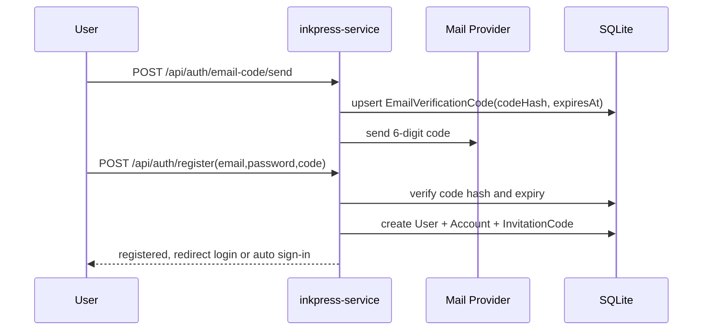
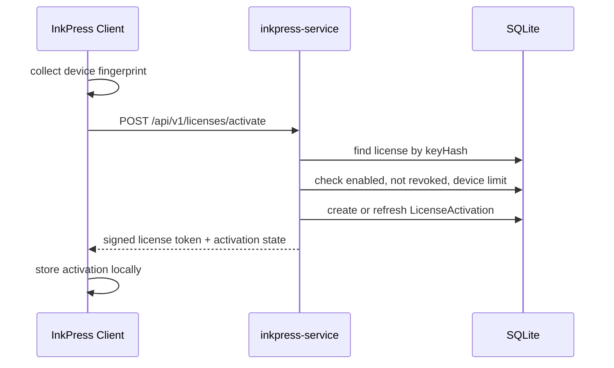

# InkPress 用户服务平台 PDC

> PDC = Product Design Contract。本文面向后续 AI/人类开发者，约定 `inkpress-service` 的产品目标、系统边界、数据模型、接口契约、License 认证、安全策略、部署方式和验收标准。
>
> 项目目录：`/Users/jielongping/OpenProject/InkPress/inkpress-service`。该目录是独立 Node 项目，只通过公网 API 与 InkPress 主应用通信，不与 InkPress 主项目共享运行时、数据库、依赖安装或构建产物。

---

## 1. 设计结论

`inkpress-service` 是 InkPress 的用户、认证、License、邀请归因和管理后台服务。首期不做支付，不做自动发码，License Key 由管理员在后台人工生成并分配。

推荐技术栈：

| 层 | 选型 |
|---|---|
| 框架 | Next.js App Router + React + TypeScript |
| 认证 | NextAuth/Auth.js，Credentials + GitHub OAuth |
| 数据 | Prisma + SQLite，后续保留 PostgreSQL 迁移空间 |
| UI | Tailwind CSS + shadcn/Radix 风格，保持 InkPress 技术体验一致 |
| API | Next.js Route Handler，统一 Zod 校验 |
| 邮件 | pluggable mail adapter，开发可用 console/file，生产接 SMTP/Resend/SES |
| 部署 | Docker / Docker Compose，持久化 `/data` |
| 日志 | pino 结构化日志，隐藏敏感字段 |

首期系统分三类入口：

1. 用户端：注册、邮箱验证、登录、GitHub 登录、查看自己的 License/邀请码。
2. 管理端：用户管理、License Key 生成/禁用、激活记录、审计日志。
3. InkPress 客户端 API：License 激活、启动校验、设备解绑申请或管理员解绑。

---

## 2. 范围与非范围

### 2.1 范围内

- 普通用户注册、邮箱密码登录、GitHub OAuth 登录。
- 邮箱注册 6 位数字验证码，10 分钟有效。
- 两种角色：`ADMIN`、`USER`。
- 每个登录用户绑定唯一邀请码，6 位大小写敏感字母数字组合。
- 管理员生成 License Key，支持有效期模板、设备数限制、邀请码归因。
- License 激活、启动刷新校验、过期/禁用/设备超限处理。
- 公网 API 的鉴权、签名、防重放、限流、审计。
- Docker 单独部署。

### 2.2 范围外

- 支付、订单、自动发码。
- 企业组织、多租户、团队席位。
- 完全不可破解的客户端保护。首期目标是显著提高绕过成本，并在服务端保留最终判定权。
- 与 InkPress 主应用共库或共进程部署。

---

## 3. 角色与权限

### 3.1 角色

| 角色 | 说明 |
|---|---|
| `USER` | 普通注册用户，可登录、查看个人信息、查看邀请码、查看归属于自己的 License 激活概况。 |
| `ADMIN` | 管理员，可管理用户、生成/禁用 License Key、查看激活记录、处理设备解绑、查看审计日志。 |

### 3.2 注册限制

- 仅允许注册普通用户。
- 管理员不能通过公开注册产生，必须通过 seed、环境变量初始化或数据库后台提升。
- 首次部署时支持 `ADMIN_EMAIL` + `ADMIN_PASSWORD` 初始化管理员，初始化后必须要求修改密码。

### 3.3 权限原则

- 管理端页面和 `/api/admin/*` 必须校验 session 且角色为 `ADMIN`。
- 用户端 `/api/me/*` 只允许访问当前用户自己的数据。
- InkPress 客户端 API 不使用用户 session，使用 License 协议签名与设备凭证。

---

## 4. 核心业务流程

### 4.1 邮箱注册



规则：

- 验证码为 6 位数字，展示和邮件里只出现明文，数据库只存 `codeHash`。
- 验证码 10 分钟有效，同一邮箱 60 秒内不可重复发送。
- 同一邮箱 10 分钟最多发送 5 次，24 小时最多 20 次。
- 注册成功后验证码标记为 `usedAt`，不可复用。
- 密码使用 `argon2id` 或 `bcrypt` 12+ cost 哈希，不存明文。

### 4.2 GitHub OAuth 登录

- 使用 NextAuth GitHub Provider。
- GitHub 邮箱已验证时可直接创建用户。
- 如果 GitHub 未返回 verified email，要求用户补充并验证邮箱后再完成账号。
- 同邮箱已存在密码账号时，允许绑定 GitHub account，但需要先登录原账号或完成邮箱验证。

### 4.3 License 生成

管理员在后台创建 License Key：

- 输入/选择有效期：1 年、3 年、5 年、自定义年份、永久。
- 输入设备数上限，默认 1，必须大于 0。
- 可选绑定邀请码。绑定后记录 `inviterUserId`，后续激活归因到邀请用户。
- 可选备注、标签、内部批次号。
- Key 由服务端生成，类似 UUID，但建议使用带前缀和校验段的格式，例如 `INKP-<base32-random>-<check>`，展示友好且便于识别。数据库中保存唯一 `keyHash` 用于匹配，同时以 AES-256-GCM 加密保存完整 key；管理端默认只展示后缀和指纹，详情页需输入二次查看密码才可临时解密展示完整 key。

### 4.4 License 激活



规则：

- 激活使用明文 License Key，但服务端只用哈希匹配。
- 同一个 License Key + 同一设备重复激活必须幂等，返回原激活记录。
- 首次激活时开始计算有效期：`expiresAt = activatedAt + duration`；永久 License 的 `expiresAt = null`。
- 如果 License 已经有首个激活时间，后续新设备沿用同一个 `effectiveExpiresAt`，不能每台设备重新延长。
- 设备数限制以 `ACTIVE` 激活记录计数。禁用、撤销、解绑记录不计数。
- 设备唯一标识不能只依赖 MAC，客户端应上传稳定设备指纹：`machineIdHash`、`macHash`、`hostnameHash`、`os`、`arch`、`appVersion`。首期以 `machineIdHash` 作为主键，MAC 作为辅助字段。

### 4.5 启动刷新校验

InkPress 每次启动必须调用 `/api/v1/licenses/validate`：

- 在线且服务端返回有效：继续使用，刷新本地缓存。
- 在线且返回过期/禁用/设备解绑/签名无效：跳转激活页，阻断核心功能。
- 网络失败：允许短暂离线宽限期，建议 72 小时；超过宽限期必须阻断核心功能。

本地缓存只用于改善离线体验，不能作为最终有效性来源。

---

## 5. License 客户端安全设计

License 逻辑无法做到绝对不可破解，但可以通过服务端最终判定、签名、防重放、代码混淆和多点校验提高绕过成本。

### 5.1 本地存储

InkPress 客户端本地保存：

- `activationId`
- `licenseFingerprint`，例如 key 明文的 SHA-256 截断，不保存完整 key。
- `deviceId`
- `licenseToken`，服务端签发的 JWS/JWT 或自定义 Ed25519 签名 payload。
- `lastValidatedAt`
- `offlineGraceExpiresAt`

敏感数据应放入系统安全存储：

- macOS Keychain
- Windows Credential Manager
- Linux Secret Service，失败时落加密文件

### 5.2 服务端签名 token

服务端返回的 `licenseToken` payload 建议包含：

```ts
type LicenseTokenPayload = {
  iss: "inkpress-service";
  aud: "inkpress-client";
  activationId: string;
  licenseId: string;
  deviceId: string;
  status: "ACTIVE";
  effectiveExpiresAt: string | null;
  maxDevices: number;
  issuedAt: string;
  nextCheckAt: string;
  tokenExpiresAt: string;
};
```

要求：

- 使用非对称签名，客户端内置公钥，服务端保管私钥。
- token 有较短有效期，建议 24 小时；每次启动或定时刷新。
- 客户端即使拿到旧 token，也必须检查 `tokenExpiresAt` 和 `nextCheckAt`。

### 5.3 防重放请求

客户端请求头：

| Header | 说明 |
|---|---|
| `X-InkPress-Client-Id` | 客户端安装 ID，首次启动生成 UUID。 |
| `X-InkPress-Device-Id` | 设备指纹 hash。 |
| `X-InkPress-Timestamp` | Unix 秒。 |
| `X-InkPress-Nonce` | 每次请求随机值。 |
| `X-InkPress-Signature` | HMAC/Ed25519 请求签名。 |

首期激活前没有共享密钥，激活请求只能依赖 HTTPS、限流、验证码式后台风控和 License Key 强随机性。激活成功后，服务端下发 `activationSecret`，客户端安全保存，后续 validate/deactivate 使用该 secret 签名。

服务端校验：

- 时间偏差不超过 5 分钟。
- nonce 10 分钟内不可重复。
- 签名覆盖 method、path、timestamp、nonce、body hash。
- 激活记录状态必须为 `ACTIVE`。

### 5.4 反绕过策略

InkPress 主应用需做多点阻断：

- 应用启动阶段验证 License，未通过不加载主工作区。
- AI 生成、发布、导出等核心 API 入口再次校验 License 状态。
- UI 层隐藏入口只能作为体验优化，不能作为唯一保护。
- 将 License 校验逻辑封装为单一 `licenseGuard`，所有核心能力复用。
- 打包时开启 asar、代码压缩、签名和完整性校验。
- 日志中记录异常状态切换，例如本地 token 被篡改、设备 ID 变化、时间回拨。

---

## 6. 数据模型

以下为首期 Prisma 模型建议，字段名可按项目风格微调，但语义不得丢失。

### 6.1 User

```prisma
model User {
  id            String   @id @default(cuid())
  email         String   @unique
  emailVerified DateTime?
  name          String?
  image         String?
  passwordHash  String?
  role          UserRole @default(USER)
  status        UserStatus @default(ACTIVE)
  inviteCode    InvitationCode?
  accounts      Account[]
  sessions      Session[]
  createdAt     DateTime @default(now())
  updatedAt     DateTime @updatedAt

  @@index([role])
  @@index([status])
}

enum UserRole {
  ADMIN
  USER
}

enum UserStatus {
  ACTIVE
  DISABLED
  DELETED
}
```

### 6.2 NextAuth 表

使用 Auth.js/NextAuth 官方 Prisma Adapter 表：`Account`、`Session`、`VerificationToken`。邮箱验证码业务不复用 `VerificationToken`，单独建表以支持次数、用途和审计。

### 6.3 EmailVerificationCode

```prisma
model EmailVerificationCode {
  id          String   @id @default(cuid())
  email       String
  purpose     EmailCodePurpose
  codeHash    String
  attempts    Int      @default(0)
  maxAttempts Int      @default(5)
  expiresAt   DateTime
  usedAt      DateTime?
  createdIp   String?
  createdUa   String?
  createdAt   DateTime @default(now())

  @@index([email, purpose, expiresAt])
}

enum EmailCodePurpose {
  REGISTER
  RESET_PASSWORD
  CHANGE_EMAIL
}
```

首期只实现 `REGISTER`，预留其他用途。

### 6.4 InvitationCode

```prisma
model InvitationCode {
  id        String   @id @default(cuid())
  code      String   @unique
  userId    String   @unique
  user      User     @relation(fields: [userId], references: [id])
  status    InvitationStatus @default(ACTIVE)
  createdAt DateTime @default(now())
  updatedAt DateTime @updatedAt

  @@index([status])
}

enum InvitationStatus {
  ACTIVE
  DISABLED
}
```

生成规则：

- 字符集：`0-9A-Z-a-z`，共 62 个字符。
- 长度 6，大小写敏感。
- 生成后查重，冲突重试，超过 10 次报警。

### 6.5 LicenseKey

```prisma
model LicenseKey {
  id                  String   @id @default(cuid())
  keyHash             String   @unique
  keyFingerprint      String   @unique
  displayKeySuffix    String
  keyCiphertext       String?
  durationKind        LicenseDurationKind
  durationYears       Int?
  durationDays        Int?
  effectiveExpiresAt  DateTime?
  maxDevices          Int      @default(1)
  status              LicenseKeyStatus @default(ENABLED)
  inviterUserId       String?
  inviterCode         String?
  note                String?
  batchNo             String?
  createdByUserId     String
  firstActivatedAt    DateTime?
  disabledAt          DateTime?
  revokedAt           DateTime?
  createdAt           DateTime @default(now())
  updatedAt           DateTime @updatedAt
  activations         LicenseActivation[]

  @@index([status])
  @@index([inviterUserId])
  @@index([batchNo])
  @@index([createdAt])
}

enum LicenseDurationKind {
  YEAR_1
  YEAR_3
  YEAR_5
  CUSTOM_YEARS
  CUSTOM_DAYS
  PERMANENT
}

enum LicenseKeyStatus {
  ENABLED
  DISABLED
  REVOKED
}
```

说明：

- `keyHash`：使用 pepper 后的 SHA-256/Argon2 哈希，用于精确匹配。
- `keyFingerprint`：明文 key 的不可逆短指纹，用于日志、前端展示和排障。
- `displayKeySuffix`：仅保存末 4-6 位，避免管理员列表泄露完整 key。
- `keyCiphertext`：完整 key 的 AES-256-GCM 密文；仅管理员在详情页输入 `LICENSE_KEY_VIEW_PASSWORD` 后临时解密展示，历史未保存密文的 License 不可反推出完整 key。
- `effectiveExpiresAt`：首次激活后写入，用于所有设备统一过期。

### 6.6 LicenseActivation

```prisma
model LicenseActivation {
  id              String   @id @default(cuid())
  licenseKeyId    String
  licenseKey      LicenseKey @relation(fields: [licenseKeyId], references: [id])
  deviceIdHash    String
  macHash         String?
  machineIdHash   String?
  hostnameHash    String?
  os              String?
  arch            String?
  appVersion      String?
  status          ActivationStatus @default(ACTIVE)
  activationSecretHash String?
  activatedAt     DateTime @default(now())
  lastValidatedAt DateTime?
  deactivatedAt   DateTime?
  revokedAt       DateTime?
  revokedReason   String?
  ipFirst         String?
  ipLast          String?
  userAgentLast   String?
  metadataJson    String   @default("{}")
  createdAt       DateTime @default(now())
  updatedAt       DateTime @updatedAt

  @@unique([licenseKeyId, deviceIdHash])
  @@index([deviceIdHash])
  @@index([status])
  @@index([lastValidatedAt])
}

enum ActivationStatus {
  ACTIVE
  DEACTIVATED
  REVOKED
}
```

### 6.7 LicenseValidationLog

```prisma
model LicenseValidationLog {
  id             String   @id @default(cuid())
  licenseKeyId   String?
  activationId   String?
  deviceIdHash   String?
  action         LicenseApiAction
  result         LicenseApiResult
  reason         String?
  ip             String?
  userAgent      String?
  appVersion     String?
  createdAt      DateTime @default(now())

  @@index([licenseKeyId, createdAt])
  @@index([activationId, createdAt])
  @@index([deviceIdHash, createdAt])
  @@index([action, result, createdAt])
}

enum LicenseApiAction {
  ACTIVATE
  VALIDATE
  DEACTIVATE
}

enum LicenseApiResult {
  ALLOWED
  DENIED
  RATE_LIMITED
  ERROR
}
```

### 6.8 AuditLog

```prisma
model AuditLog {
  id          String   @id @default(cuid())
  actorUserId String?
  actorRole   String?
  action      String
  targetType  String?
  targetId    String?
  beforeJson  String?
  afterJson   String?
  ip          String?
  userAgent   String?
  createdAt   DateTime @default(now())

  @@index([actorUserId, createdAt])
  @@index([targetType, targetId])
  @@index([action, createdAt])
}
```

---

## 7. API 契约

所有 API 响应统一：

```ts
type ApiSuccess<T> = {
  ok: true;
  data: T;
  requestId: string;
};

type ApiError = {
  ok: false;
  error: {
    code: string;
    message: string;
    details?: unknown;
  };
  requestId: string;
};
```

### 7.1 用户认证 API

| Method | Path | 说明 | 认证 |
|---|---|---|---|
| `POST` | `/api/auth/email-code/send` | 发送注册验证码 | public + rate limit |
| `POST` | `/api/auth/register` | 邮箱密码注册 | public + code |
| `GET/POST` | `/api/auth/[...nextauth]` | NextAuth | NextAuth |
| `GET` | `/api/me` | 当前用户信息 | session |
| `GET` | `/api/me/invitation-code` | 当前用户邀请码 | session |
| `GET` | `/api/me/licenses` | 当前用户邀请归因的 License 概况 | session |

### 7.2 管理 API

| Method | Path | 说明 |
|---|---|---|
| `GET` | `/api/admin/users` | 用户列表，支持 email/status/role 查询 |
| `PATCH` | `/api/admin/users/:id` | 禁用/启用用户，修改角色仅允许 ADMIN |
| `POST` | `/api/admin/licenses` | 创建 License Key |
| `GET` | `/api/admin/licenses` | License Key 列表 |
| `GET` | `/api/admin/licenses/:id` | License 详情和激活记录 |
| `PATCH` | `/api/admin/licenses/:id` | 禁用、启用、撤销、修改备注 |
| `POST` | `/api/admin/licenses/:id/reveal-key` | 输入二次查看密码后返回完整 License Key |
| `POST` | `/api/admin/licenses/:id/activations/:activationId/revoke` | 解绑/撤销某台设备 |
| `GET` | `/api/admin/audit-logs` | 审计日志 |

创建 License 请求：

```ts
type CreateLicenseRequest = {
  durationKind: "YEAR_1" | "YEAR_3" | "YEAR_5" | "CUSTOM_YEARS" | "CUSTOM_DAYS" | "PERMANENT";
  durationYears?: number;
  durationDays?: number;
  maxDevices: number;
  inviterCode?: string;
  note?: string;
  batchNo?: string;
};
```

创建 License 响应会返回完整 Key，并在数据库中加密留存，便于后续管理员经二次密码查看：

```ts
type CreateLicenseResponse = {
  id: string;
  licenseKey: string;
  keyFingerprint: string;
  maxDevices: number;
  durationKind: string;
  inviterCode?: string;
};
```

### 7.3 InkPress 客户端 API

| Method | Path | 说明 |
|---|---|---|
| `POST` | `/api/v1/licenses/activate` | 输入 License Key 激活当前设备 |
| `POST` | `/api/v1/licenses/validate` | 启动或定时校验激活状态 |
| `POST` | `/api/v1/licenses/deactivate` | 用户主动释放本设备 |

激活请求：

```ts
type ActivateLicenseRequest = {
  licenseKey: string;
  device: {
    deviceIdHash: string;
    machineIdHash?: string;
    macHash?: string;
    hostnameHash?: string;
    os: "darwin" | "win32" | "linux";
    arch: string;
  };
  app: {
    version: string;
    buildNumber?: string;
    channel?: "stable" | "beta" | "dev";
  };
};
```

激活响应：

```ts
type ActivateLicenseResponse = {
  activationId: string;
  status: "ACTIVE";
  effectiveExpiresAt: string | null;
  maxDevices: number;
  activatedDevices: number;
  licenseToken: string;
  activationSecret: string;
  nextCheckAt: string;
  inviterCode?: string;
};
```

校验请求：

```ts
type ValidateLicenseRequest = {
  activationId: string;
  deviceIdHash: string;
  appVersion: string;
  licenseToken?: string;
};
```

校验响应：

```ts
type ValidateLicenseResponse = {
  status: "ACTIVE" | "EXPIRED" | "DISABLED" | "REVOKED" | "DEVICE_MISMATCH";
  effectiveExpiresAt: string | null;
  licenseToken?: string;
  nextCheckAt?: string;
  offlineGraceSeconds?: number;
  message?: string;
};
```

---

## 8. 管理后台页面

首期页面：

| 页面 | 路径 | 能力 |
|---|---|---|
| 登录页 | `/login` | 邮箱密码登录、GitHub 登录 |
| 注册页 | `/register` | 邮箱验证码注册 |
| 用户首页 | `/dashboard` | 展示邮箱、邀请码、归因 License 摘要 |
| License 管理 | `/admin/licenses` | 列表、筛选、生成、禁用 |
| License 详情 | `/admin/licenses/[id]` | 激活设备、校验日志、归因信息、二次密码查看完整 Key |
| 用户管理 | `/admin/users` | 用户状态、角色、邀请码 |
| 审计日志 | `/admin/audit-logs` | 管理操作记录 |

UI 要求：

- 操作型后台优先密度和可扫描性，避免营销式首屏。
- License Key 创建弹窗展示完整 key 并支持复制；关闭后可在详情页输入二次密码再次查看。
- 列表中默认只展示 key 后缀和 fingerprint，不展示完整 key；详情页查看完整 key 必须写入审计日志。
- 所有危险操作二次确认：禁用 key、撤销 key、解绑设备、禁用用户。

---

## 9. 安全策略

### 9.1 通信安全

- 生产必须 HTTPS，禁止客户端 License API 使用明文 HTTP。
- 配置 `SECURE_COOKIES=true`，NextAuth cookie 使用 `HttpOnly`、`Secure`、`SameSite=Lax`。
- 所有 JSON API 限制 body 大小，建议 64 KB。
- 设置安全响应头：`Content-Security-Policy`、`X-Frame-Options`、`X-Content-Type-Options`、`Referrer-Policy`。

### 9.2 密钥管理

环境变量：

| 变量 | 说明 |
|---|---|
| `DATABASE_URL` | `file:/data/inkpress-service.db` |
| `NEXTAUTH_SECRET` | session 加密密钥 |
| `NEXTAUTH_URL` | 服务公网地址 |
| `GITHUB_ID` / `GITHUB_SECRET` | GitHub OAuth |
| `LICENSE_KEY_PEPPER` | License Key 哈希 pepper |
| `LICENSE_KEY_VIEW_PASSWORD` | 管理后台查看完整 License Key 的二次密码 |
| `LICENSE_KEY_ENCRYPTION_SECRET` | 完整 License Key AES-256-GCM 加密密钥 |
| `LICENSE_TOKEN_PRIVATE_KEY` | License token 签名私钥 |
| `LICENSE_TOKEN_PUBLIC_KEY` | 可选，给客户端嵌入的公钥来源 |
| `MAIL_PROVIDER` | `console` / `smtp` / `resend` |
| `SMTP_*` 或 `RESEND_API_KEY` | 邮件配置 |
| `ADMIN_EMAIL` / `ADMIN_PASSWORD` | 首次初始化管理员 |

要求：

- `LICENSE_KEY_PEPPER`、`LICENSE_KEY_ENCRYPTION_SECRET`、查看密码和私钥一旦泄露必须轮换。
- 日志、审计、错误响应不得输出验证码、License 明文、activationSecret、OAuth token；查看完整 License Key 的审计只记录指纹/后缀。

### 9.3 限流

首期 SQLite 可用本地表或内存限流；生产单实例 Docker 足够。后续多实例迁 Redis。

建议策略：

| 场景 | 限流 |
|---|---|
| 发送邮箱验证码 | 每邮箱 60 秒 1 次，每 IP 每小时 30 次 |
| 注册 | 每 IP 每小时 20 次 |
| 登录密码 | 每邮箱/IP 每 15 分钟 10 次，失败递增退避 |
| License 激活 | 每 IP 每分钟 20 次，每 key 每小时 30 次 |
| License 校验 | 每 activation 每分钟 10 次，每 IP 每分钟 120 次 |
| 管理 API | 每管理员每分钟 120 次 |

命中限流返回 `429` 和稳定错误码 `RATE_LIMITED`。

### 9.4 输入校验与审计

- 所有 route handler 必须使用 Zod schema。
- 所有管理变更写 `AuditLog`。
- 所有 License activate/validate/deactivate 写 `LicenseValidationLog`，可异步但不能吞异常到不可见。
- 对公网错误消息做模糊化，例如 License 不存在、禁用、撤销可以分别给客户端明确业务码，但不要泄露 key 是否存在给未签名的批量探测场景；激活接口可统一消息，日志记录真实原因。

---

## 10. 项目结构

建议目录：

```text
inkpress-service/
  src/
    app/
      (auth)/
      admin/
      dashboard/
      api/
        auth/
        admin/
        me/
        v1/licenses/
    components/
      admin/
      auth/
      layout/
      ui/
    lib/
      auth/
      db/
      email/
      license/
      rate-limit/
      security/
      audit/
      validation/
    middleware.ts
  prisma/
    schema.prisma
    seed.ts
    migrations/
  scripts/
    init-admin.ts
    rotate-license-keys.ts
  Dockerfile
  docker-compose.yml
  package.json
  README.md
  .env.example
```

---

## 11. Docker 部署契约

### 11.1 Dockerfile

- 使用 Node 22 LTS。
- 构建阶段安装依赖、`prisma generate`、`next build`。
- 运行阶段只包含 `.next/standalone`、`public`、`prisma` 必要产物。
- 启动时执行 `prisma migrate deploy`，再启动 Next server。

### 11.2 docker-compose

```yaml
services:
  inkpress-service:
    image: inkpress-service:latest
    ports:
      - "3001:3000"
    env_file:
      - .env
    volumes:
      - ./data:/data
    restart: unless-stopped
```

SQLite 文件固定在 `/data/inkpress-service.db`。备份 `/data` 即可备份数据库和运行态文件。

---

## 12. InkPress 主应用改造契约

InkPress 主应用后续需要新增：

1. License 激活页面：输入 License Key，展示激活状态和错误原因。
2. License 启动检查：应用启动时调用 `validate`，未通过进入激活页。
3. 本地 License Store：安全保存 activation 信息和 token。
4. `licenseGuard`：核心能力统一调用。
5. 设备指纹采集：跨平台生成稳定 `deviceIdHash`，避免直接上传明文 MAC。
6. 设置页 License 状态：显示有效期、设备、上次校验时间、手动刷新、释放本机。

核心阻断点：

- 写作工作区入口。
- AI 生成接口。
- 文章导出/发布。
- 自动化/Agent 长任务启动。

---

## 13. 状态码与错误码

License API 错误码：

| Code | HTTP | 说明 |
|---|---:|---|
| `LICENSE_INVALID` | 400 | Key 格式错误或不存在 |
| `LICENSE_DISABLED` | 403 | Key 已禁用 |
| `LICENSE_REVOKED` | 403 | Key 已撤销 |
| `LICENSE_EXPIRED` | 403 | Key 已过期 |
| `DEVICE_LIMIT_EXCEEDED` | 409 | 已达到设备数上限 |
| `DEVICE_MISMATCH` | 403 | activation 与设备不匹配 |
| `ACTIVATION_REVOKED` | 403 | 当前设备激活已撤销 |
| `SIGNATURE_INVALID` | 401 | 请求签名错误 |
| `REPLAY_DETECTED` | 401 | nonce 重放 |
| `RATE_LIMITED` | 429 | 请求过于频繁 |

用户认证错误码：

| Code | HTTP | 说明 |
|---|---:|---|
| `EMAIL_CODE_INVALID` | 400 | 验证码错误 |
| `EMAIL_CODE_EXPIRED` | 400 | 验证码过期 |
| `EMAIL_ALREADY_REGISTERED` | 409 | 邮箱已注册 |
| `PASSWORD_INVALID` | 400 | 密码不符合规则 |
| `ACCOUNT_DISABLED` | 403 | 用户已禁用 |

---

## 14. 测试与验收

### 14.1 单元测试

- 邀请码生成唯一性和大小写敏感。
- License Key 生成、哈希、fingerprint、唯一性。
- 有效期计算：1/3/5 年、自定义年份、自定义天数、永久。
- 激活幂等：同 key 同设备重复激活不增加设备数。
- 设备数限制：达到上限后新设备返回 `DEVICE_LIMIT_EXCEEDED`。
- 过期、禁用、撤销状态校验。
- 签名校验、nonce 重放、timestamp 过期。

### 14.2 集成测试

- 邮箱验证码注册完整链路。
- Credentials 登录和 GitHub OAuth account 绑定逻辑。
- 管理员创建 License，普通用户无法访问管理 API。
- 激活后 validate 成功，撤销后 validate 失败。
- 邀请码绑定 License 后，激活记录能追溯邀请用户。

### 14.3 E2E 测试

- 普通用户注册、登录、查看邀请码。
- 管理员登录、生成 License、详情页输入二次密码查看完整 Key、列表只显示后缀。
- InkPress 客户端模拟激活、重启校验、过期阻断。

### 14.4 验收标准

- `inkpress-service` 可在 `/Users/jielongping/OpenProject/InkPress/inkpress-service` 独立安装、构建、运行。
- Docker 部署后访问公网地址可完成注册、登录和管理 License。
- 首期 SQLite 数据持久化到 `/data`，容器重启不丢失。
- 所有公网 API 有输入校验、限流、结构化错误和 requestId。
- License 明文不进日志、不在列表页展示；数据库仅保存加密密文，详情页查看需二次密码并审计。
- InkPress 客户端每次启动必须校验 License，服务端判定无效时阻断核心功能。

---

## 15. 分阶段实施建议

### Phase 1：服务骨架与认证

- 初始化 `inkpress-service` 独立 Next.js 项目。
- Prisma + SQLite + NextAuth。
- 邮箱验证码注册、密码登录、GitHub OAuth。
- 用户、角色、邀请码。
- Dockerfile、compose、README、`.env.example`。

### Phase 2：License 管理

- LicenseKey、LicenseActivation、ValidationLog、AuditLog。
- 管理员生成/禁用/撤销 License。
- License 列表和详情页。
- 邀请码归因。

### Phase 3：客户端 License API

- activate/validate/deactivate。
- token 签名、activationSecret、nonce 防重放。
- 限流和审计。
- InkPress 客户端接入激活页、启动校验、本地存储和 `licenseGuard`。

### Phase 4：安全加固与运维

- 邮件生产 Provider。
- 安全响应头、日志脱敏、备份脚本。
- 管理端操作审计完善。
- 客户端混淆、完整性检查、异常风控。

---

## 16. 开放问题

这些问题不阻塞首期开发，但应在实现前或 Phase 2 前确认：

1. License 是否允许用户自助释放设备，还是仅管理员解绑。
2. GitHub 登录是否必须绑定 verified email，推荐必须。
3. 离线宽限期采用 72 小时还是更短。
4. 邀请码归因是否只在 License 创建时绑定，还是激活时也允许用户填写邀请码。推荐只在管理员生成时绑定，避免激活端刷归因。
5. 管理员初始化后是否强制关闭 `ADMIN_PASSWORD` seed 重复执行。推荐 seed 只在无管理员时生效。
